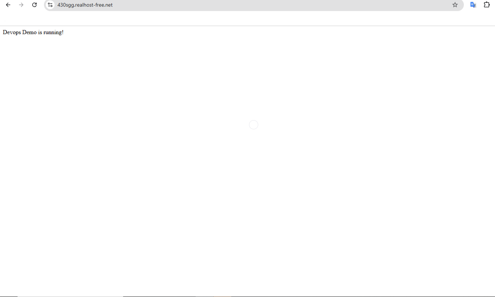
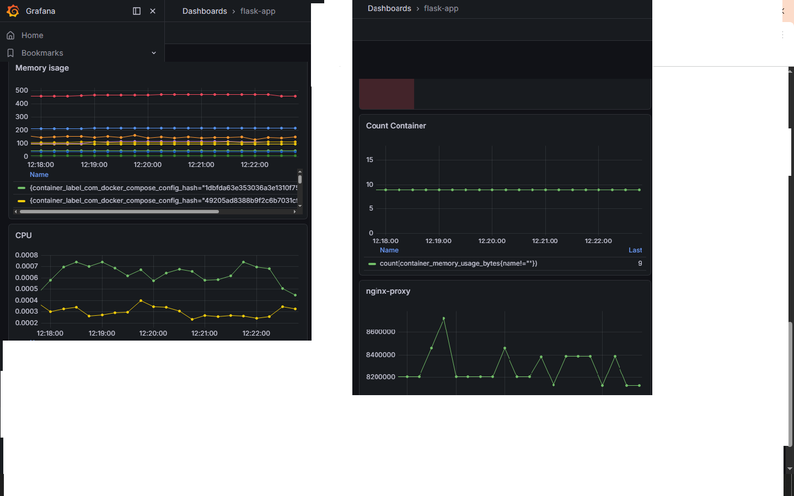
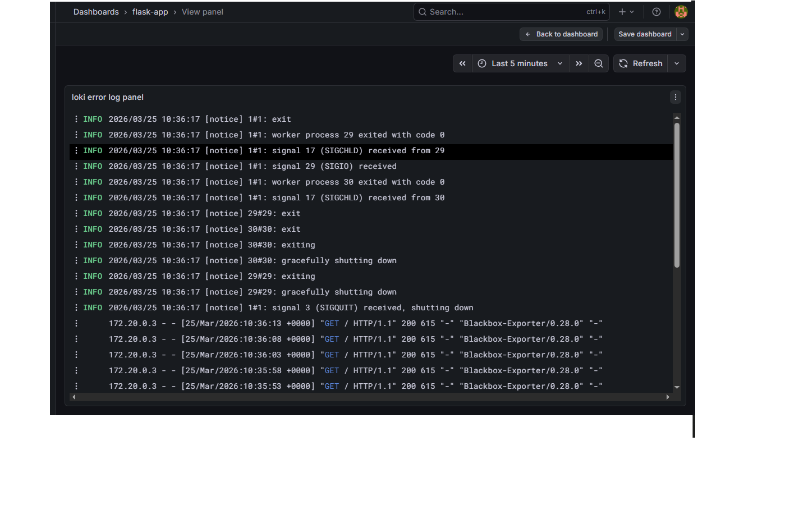
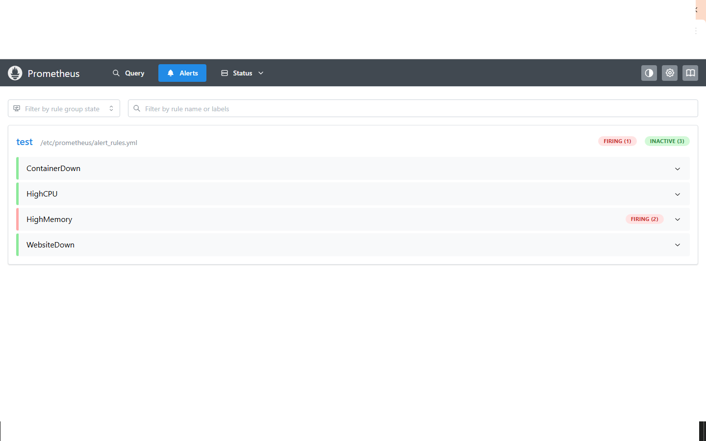

## DevOps DEMO PROJECT

## LIVE DEMO

https://www.430sgg.realhost-free.net


## PROJECT OVERVIEW

This project demonstrates a full DevOps setup with multiple deployment approaches:

- Docker Compose (local monitoring stack)
- Kubernetes (k3s on VPS)
- CI/CD (GitHub Actions)
- Infrastructure as Code (Terraform)


## ARCHITECTURE (Production)

User → Domain → Ingress → Service → Pod (Flask App)


## TECH STACK

- Docker / Docker Compose
- Kubernetes (k3s)
- Nginx (Ingress)
- GitHub Actions (CI/CD)
- Terraform
- Prometheus + Grafana + Loki
- Alertmanager (Telegram)


## DEPLOYMENT OPTIONS

#1️⃣ KUBERNETES (Production - VPS)

Deployed on VPS using k3s

```bash
cd k8s/app
kubectl apply -f .```

Includes:

- Deployment
- Service
- Ingress
- TLS (cert-manager)


#2️⃣ MONITORING STACK (Docker Compose)

Run locally:

```bash
cd monitoring
docker-compose up -d```

Services:

- Prometheus
- Grafana
- Loki
- Alertmanager
- Blackbox exporter


#3️⃣ KUBERNETES MONITORING (Optional)

Located in:

k8s/monitoring/

Not enabled on VPS due to resource limits


#4️⃣ TERRAFORM (Infrastructure)
```bash
cd terraform
terraform init
terraform apply```


## CI/CD PIPELINE

Pipeline:

- Builds Docker image
- Pushes to DockerHub
- Deploys to VPS via SSH
- Performs rolling update


## PROJECT STRUCTURE

.
├── app/                # Flask application
├── k8s/
│   ├── app/            # Kubernetes manifests (app)
│   ├── monitoring/     # Kubernetes monitoring stack
├── monitoring/         # Docker Compose monitoring
├── nginx/              # Nginx config
├── terraform/          # Infrastructure
├── .github/workflows/  # CI/CD


## CI/CD FLOW

git push → build → push → SSH → deploy → rollout


## FEATURES

- Kubernetes deployment
- CI/CD automation
- Monitoring & logging
- TLS (HTTPS)
- Alerts (Telegram)


## SCREENSHOTS
### App
App on a VPS Server



### Grafana dashboard
Monitoring CPU, memory usage and container status.



### Loki logs
Centralized logs collected from all containers.



### Alert
Example of alerts(ContainerDown, HighCPU, etc.)



## NOTES
- Monitoring in Kubernetes disabled due to VPS limits
- Production setup uses minimal resources
