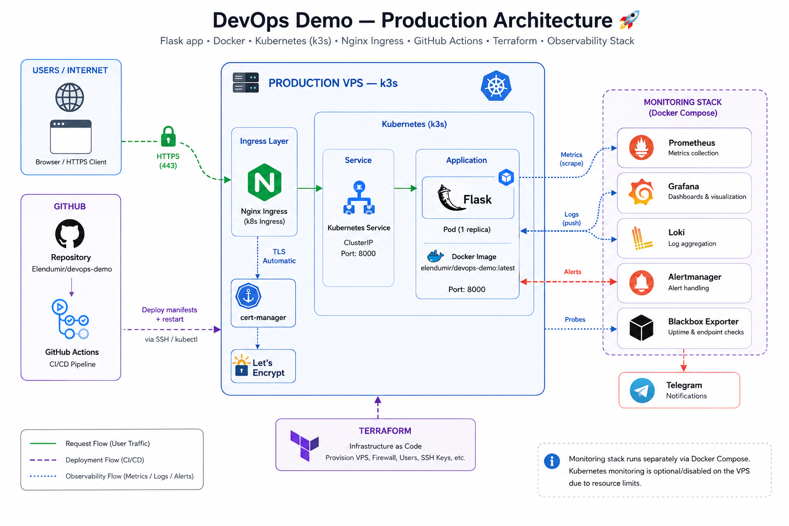
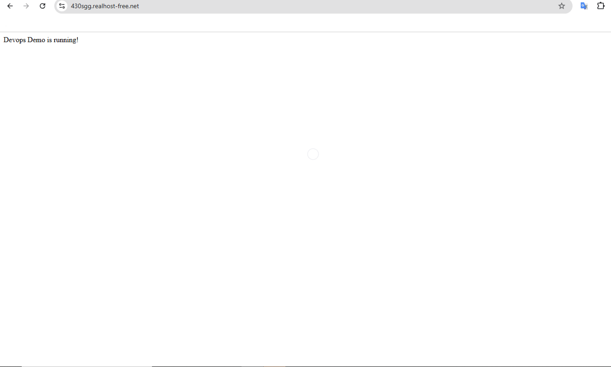
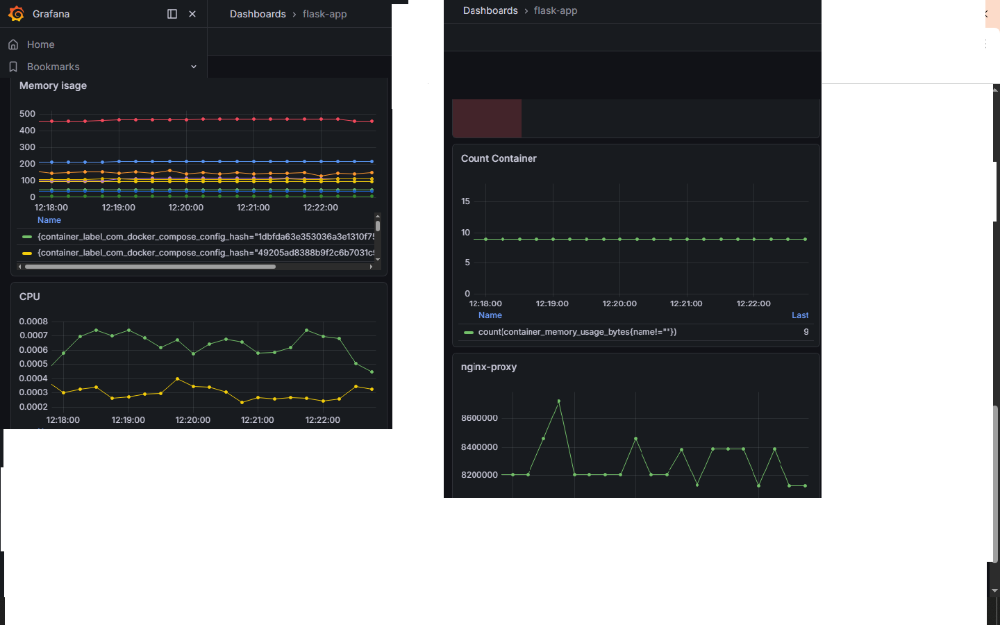
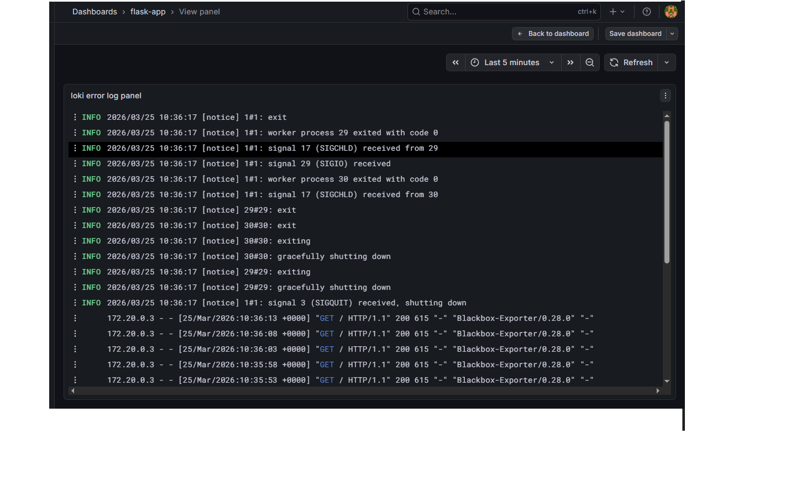
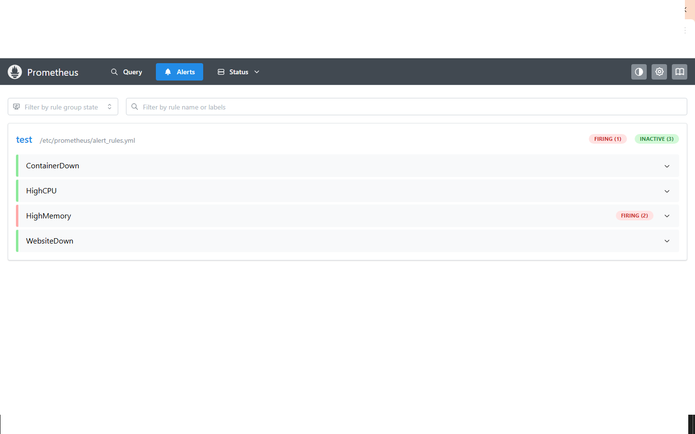

## DevOps DEMO PROJECT

This project demonstrates a real-world DevOps  workflow:

- Containerized application (Flask + Nginx)
- Kubernetes deployment  (k3s on VPS)
- CI/CD pipeline using GitHub Actions
- Infrastructure provisioning with Terraform
- Monitoring stack (Prometheus + Grafana + Loki)

The goal is to simulate a production-like environment

## LIVE DEMO

https://www.430sgg.realhost-free.net

## ARCHITECTURE (Production)




## TECHNOLOGY STACK 

- Docker / Docker Compose
- Kubernetes (k3s)
- Nginx (Ingress)
- GitHub Actions (CI/CD)
- Terraform
- Prometheus + Grafana + Loki
- Alertmanager (Telegram)
  
## PROJECT STRUCTURE


## DEPLOYMENT STEPS

#1️⃣ KUBERNETES (Production - VPS)

Deployed on VPS using k3s

```bash
cd k8s/app
kubectl apply -f .
```

Includes:

- Deployment
- Service
- Ingress
- TLS (cert-manager)


#2️⃣ MONITORING STACK (Docker Compose)

Run locally:

```bash
cd monitoring
docker-compose up -d
```

Services:

- Prometheus
- Grafana
- Loki
- Alertmanager
- Blackbox exporter


#3️⃣ KUBERNETES MONITORING (Optional)

Located in:

k8s/monitoring/

Not enabled on VPS due to resource limits


#4️⃣ TERRAFORM (Infrastructure)

```bash
cd terraform
terraform init
terraform apply
```


## CI/CD PIPELINE

CI/CD is implemented using GitHub Actions

##WORKFLOW:

1. Developer pushescode to GitHub
2. GitHub Actions triggers pipeline
3. Pipeline connects to VPS via SSH
4. Kubernetes manifestst are applied
5. Deployment is restarted 

 

## FEATURES

- Kubernetes deployment
- CI/CD automation
- Monitoring & logging
- TLS (HTTPS)
- Alerts (Telegram)


## SCREENSHOTS
### App
App on a VPS Server



### Grafana dashboard
Monitoring CPU, memory usage and container status.



### Loki logs
Centralized logs collected from all containers.



### Alert
Example of alerts(ContainerDown, HighCPU, etc.)



## NOTES
- Monitoring in Kubernetes disabled due to VPS limits
- Production setup uses minimal resources
